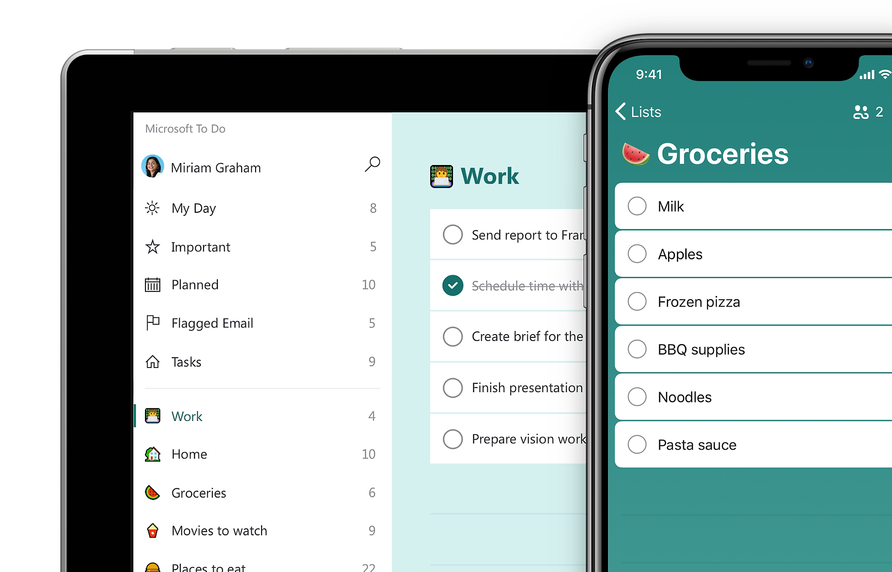

# TaskList

TaskList es una lista de tareas para el navegador. La idea es simple: anotas lo que
tienes que hacer, lo vas marcando conforme lo terminas y borras lo que ya no sirve.
Nada de cuentas ni configuración: abres la página y empiezas a escribir.

## Por dónde empezar

Si es tu primera vez, lo más rápido es seguir estos dos pasos:

- Monta el proyecto siguiendo la [guía de instalación](instalacion.md).
- Cuando lo tengas corriendo, pásate por la [guía de uso](guia-de-uso.md) para ver
  cómo se trabaja con las tareas.

## Qué puedes hacer

- Crear tareas y borrarlas cuando ya no las necesitas.
- Marcarlas como completadas con un clic.
- Separar de un vistazo lo que está pendiente de lo que ya terminaste.
- Olvidarte de guardar: todo queda almacenado en tu propio navegador.

!!! note "Sobre este proyecto"
    TaskList es una app de ejemplo, así que no esperes un gestor de proyectos
    completo. Aun así, todo lo que se explica aquí funciona de verdad si la levantas
    en tu equipo.
